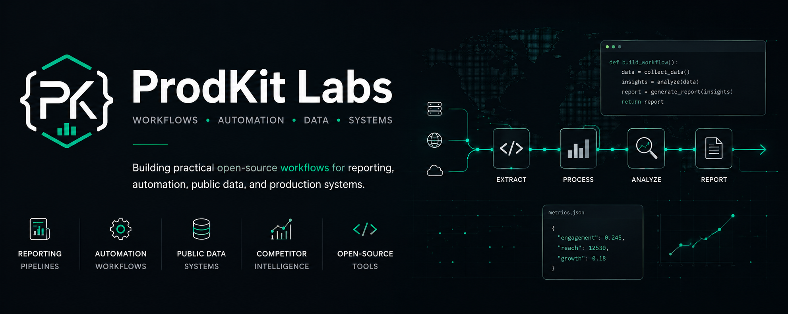

  

# ProdKit Labs

ProdKit Labs builds small, runnable production kits for developer workflows.

Each kit starts with working examples, local fixtures, benchmark scripts, operational notes, and clear provider boundaries. The goal is to help developers move from "it works locally" to something they can debug, measure, and run with more confidence.

## Current Projects

- [Browser Automation Production Kit](https://github.com/prodkit-labs/browser-automation-production-kit)  
  A Python/Crawlee/Playwright starter for turning browser automation scripts into production jobs.

- [FastAPI Auth Production Kit](https://github.com/prodkit-labs/fastapi-auth-production-kit)  
  A FastAPI starter for authentication that survives the first production handoff.

- [Instagram Competitor Intelligence](https://github.com/prodkit-labs/instagram-competitor-intelligence)  
  Python recipes for public competitor intelligence reports and scheduled monitoring.

## Principles

- Working examples before recommendations
- Local/mock execution before paid services
- Benchmarks before provider comparisons
- Clear disclosure where commercial links appear
- Compliance boundaries for scraping and automation workflows

## Interests

Python · FastAPI · Authentication · Automation · Public Data · Browser Automation · Benchmarking · Production Systems
